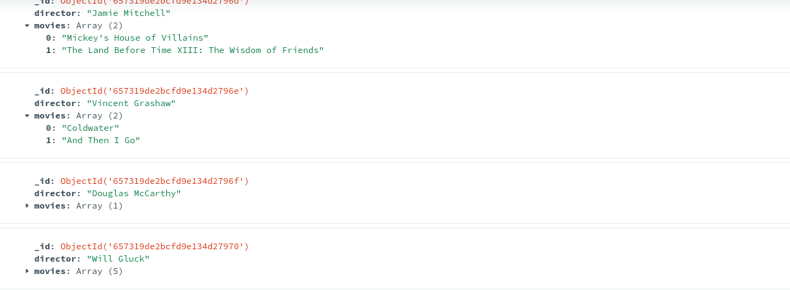

# Diginamic : TP Films IMDB

_Afin d'éviter les doublons dans la base de donnée, les lignes de création de collections etc ont été commentées_ Le projet est disponible sur [Github](https://github.com/gillesah/MongoDB_TP)

## Utilisation

1 - installer Pymongo (voir [requirements](requirements.txt)) 2 - Executer les fichiers individuellement ou 3 - executer le fichier main

```
python main.py

```

## Étape 1: Importer les données

Les données ont été nettoyées avant d'être importées dans la collection movies  
un fichier validator pour la création de la base de donnée a été mis dans le dossier Data, le code est à importer dans compass

## Étape 2: Déclaration des classes

ajout d'une classe [Director](module/director.py) et d'une classe [Movie](module/movie.py)

## Étape 3: Création d'une collection Director

Pour créer une collection director, vous pouvez run le fichier [ module/director_collection.py](module/director_collection.py) en décommentant les 2 dernières lignes cela va créer une collection avec les réalisateurs et la liste de film pour chaque réalisateur :



## Étape 4 : Agrégation

4 agrégations ont été réalisées ([dossier agregation](agregation/))

- [Lister les 5 réalisateurs les mieux notés](agregation/ag_1.py)
- [Les 5 réalisateurs dont les films ont la durée moyenne la plus importante](agregation/ag_2.py)
- [Les 5 réalisateurs ayant le plus de films](agregation/ag_3.py)
- [la liste et le nombre de films des 15 acteurs les plus présents](agregation/ag_4.py)

_en raison de problèmes avec VS Code j'ai du rajouter les lignes de connexions qui sont commentées_

```
client = MongoClient("mongodb://localhost:27017/")
# Base de donnée Cinema
db = client["cinema"]
# Collection movies
movies = db["movies"]
```

_mais en dehors de VS code l'importation fonctionne avec : _  
` from module.connexion import movies`
